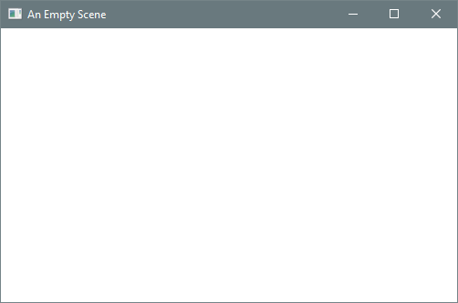
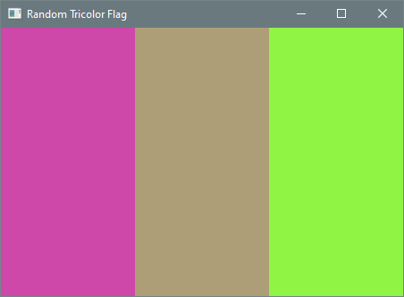
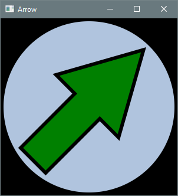

# 3.7 Graphics

**Key terms:** widget, stage, scene, node, children, scene graph, named constant

A graphics program performs such operations as drawing geometric shapes in an output window, filling 
them with colors and textures, adding visual effects like shadows, and applying geometric 
transformations like reflections and rotations. Although graphics programming is not essential for 
learning object-based programming, it provides a visually engaging setting in which to practice 
creating and using objects.

## 3.7.1 Widget Toolkits

A graphical user interface (GUI, pronounced *gooey*) enables users to interact with an 
application by manipulating **widgets** — interactive visual elements like buttons, sliders, and 
menus. Java’s Abstract Window Toolkit (AWT) is a collection of library classes included in the 
original release of Java for graphics programming and GUI construction. AWT components are thin 
wrappers around native widgets, so their appearance and behavior depend on the host system.

AWT has largely been superseded by Swing. Swing components are implemented as Java classes, so their 
rendering is performed by Java methods — that is, by the JVM. As a result, Swing components look and 
behave consistently across desktop platforms.

## 3.7.2 JavaFX

JavaFX is the newest widget toolkit, designed for building user interfaces with richer graphics and 
with a layout system better suited to a wide range of screen sizes. It provides a framework for 
developing applications whose appearance and behavior remain consistent across device types.

Although Oracle continues to support Swing, it is no longer under active development, and JavaFX 
will eventually replace it. JavaFX was first released in 2008 as an extension library and integrated 
into the JDK in 2014. In 2018, Oracle decoupled JavaFX from the JDK so that it can evolve 
independently as an open-source project maintained by OpenJFX 
(<a href="https://openjfx.io/">https://openjfx.io/</a>).

JavaFX applications are organized around the metaphor of a theater. Operations take place on a
**stage** modeled by the `Stage` class, corresponding to a top-level window. The elements to be 
displayed on stage comprise a **scene**, encapsulated by a `Scene` object. Each element within a 
scene is called a **node**. Nodes can be shapes, images, text, video, widgets, or containers of 
other nodes. The contents of a container are referred to as its children. The nodes in a scene form 
a hierarchical structure called a **scene graph**.

## 3.7.3 Empty Scene

A JavaFX program is defined by a class that extends `Application`, a JavaFX library class. The 
keyword `extends` is used to define a new class through inheritance from an existing one. 
Inheritance is one of the cornerstones of object-oriented programming, but the details are beyond 
the scope of this book. For present purposes, it suffices to know that a class extending 
`Application` must provide a `start` method, which typically creates and displays a scene.

The class also defines a `main` method that calls `launch` (inherited from `Application`); it can be 
omitted from most JavaFX applications, but there are technical situations — such as running in 
certain IDEs, performing pre-launch setup, or targeting older Java versions — where it is necessary.

Listing 3.7.3 does nothing more than display an empty scene, but it illustrates the high-level 
structure of every JavaFX application.

#### Listing 3.7.3 - [EmptyScene.java](https://github.com/drue-coles/cmsc-120/blob/master/code/src/chap03/sect7/EmptyScene.java)
``` java title="EmptyScene.java"
--8<-- "code/src/chap03/sect7/EmptyScene.java"
```

??? "Output 3.7.3"
    

The `start` method is prefaced with the `@Override` annotation. Annotations are not discussed or
used elsewhere in this book, with the single exception of `@Override`, which indicates that a method 
is inherited. While not required for functionality, `@Override` can help prevent subtle bugs and 
also serves as a form of documentation.

An instance of the `Pane` class is created at the beginning of `start` to serve as the root node of 
the scene. Several constructors are provided by the `Scene` class; the one used here takes a 
reference to the root node along with the width and height of the scene in pixels. The scene in this 
program is empty — no elements have been added. The final three lines of the `start` method specify
a stage title, attach the scene to the stage, and make the stage visible.

## 3.7.4 Rectangles and Colors

Shapes in a graphics application may appear continuous, but this is an illusion: each shape is 
ultimately rendered on a discrete grid of pixels. Shape objects store their coordinates and 
dimensions as `double` values to ensure precision in geometric calculations and transformations 
(such as rotations). Client programs typically use `double` for variables representing coordinates 
and dimensions to remain consistent with the API.

Listing 3.7.4 displays a flag composed of three vertical stripes, each rendered as a `Rectangle`. A 
rectangle is created by specifying the coordinates of its upper-left corner along with its width and 
height. In the default JavaFX coordinate system, the origin (0, 0) is located in the upper-left 
corner of the scene, with x increasing to the right and y increasing downward.

Each rectangle is added to the scene graph by calling `getChildren()` on the root node and inserting 
the rectangle into the returned list.

#### Listing 3.7.4 - [RandomTricolorFlag.java](https://github.com/drue-coles/cmsc-120/blob/master/code/src/chap03/sect7/RandomTricolorFlag.java)
``` java title="RandomTricolorFlag.java"
--8<-- "code/src/chap03/sect7/RandomTricolorFlag.java"
```

??? "Output 3.7.4"
    

Colors in JavaFX are represented by instances of the `Color` class. The program uses the RGB color 
model, in which a color is defined by the intensities of red, green, and blue. Figure 3.7.4a shows 
the colors obtained when each primary component is either absent (0) or at full intensity (1), and 
Figure 3.7.4b shows the RGB values for several other familiar colors.

Figure3.7.4a: [Binary RGB Values](images/figure3.7.4a.png)

Figure3.7.4b: [Common RGB Values](images/figure3.7.4b.png)

The static factory method `Color.color` creates a color from three double values in the range 
[0, 1), corresponding to the intensities of red, green, and blue. By selecting random values for the 
outer stripes and interpolating between them for the middle stripe, the program produces a visually 
coherent tricolor flag.

Several variables in the program are declared with the `final` keyword. A final variable, also 
called a **named constant**, is initialized once and cannot be reassigned. Using `final` for fixed 
values is considered good practice. It improves readability, reduces the likelihood of errors when a 
value is used in multiple places, and helps ensure that a variable is not repurposed in a way that 
conflicts with its intended role. In principle, every variable that is not modified after 
initialization could be declared `final`, but in some cases this may introduce a degree of visual
clutter. A practical compromise is to declare primitive values `final` when possible, and object 
references only when emphasizing that the reference should not be reassigned.

Note that many JavaFX classes have counterparts in the `java.awt` package. When working with JavaFX, 
care must be taken to import the correct classes. For example, colors in this program must be 
represented by `javafx.scene.paint.Color`, not `java.awt.Color`.

## 3.7.5 Circles and Polygons

Listing 3.7.5 displays an arrow centered within a circle. The arrow is composed of a rectangle and a 
triangle. JavaFX does not provide a dedicated triangle class, but the more general `Polygon` class 
can represent any closed shape with straight-line sides. Its constructor takes a sequence of x-y 
coordinates specifying the corners in the order they are connected; the last corner is automatically 
joined to the first to close the polygon.

#### Listing 3.7.5 - [Arrow.java](https://github.com/drue-coles/cmsc-120/blob/master/code/src/chap03/sect7/Arrow.java)
``` java title="Arrow.java"
--8<-- "code/src/chap03/sect7/Arrow.java"
```

??? "Output 3.7.5"
    

All coordinates and dimensions are expressed relative to the size of the scene, ensuring that the 
figure scales correctly if the scene size is changed. The apex of the triangle forming the arrow tip 
is positioned near the top of the scene, while the base is aligned with the horizontal center of the 
scene. The shaft is a vertical rectangle centered beneath the tip.

The arrow is rotated by a specified angle about its center. If the polygon and rectangle were not 
combined into a single shape, they could not be rotated together, and the perimeter would appear as 
a triangle atop a rectangle. To observe the difference, run the program without rotation and display 
the polygon and rectangle separately.

The examples in this section illustrate basic shapes, colors, and transformations. JavaFX also 
provides more complex shapes, lighting effects, animations, 3D graphics, and GUI widgets.
