## 3.8 Practice Problems

### 3.8.1 String Manipulation

**a. End Swapper.** Prompts the user for a word and swaps the first and last letter.

??? "Output 3.8.1a"
    ```text
    Enter a word: wombat
    WOMBAT -> tombaw
    ```

**b. Half Swapper.** Prompts the user for a word and swaps the first and second halves.

??? "Output 3.8.1b"
    ```text
    Enter a word: wombat
    wombat -> batwom
    ```

**c. Inner Spinner.** Prompts the user for a word and reverses the characters between the first and 
last letter. Use `StringBuilder` for the reversal.

??? "Output 3.8.1c"
    ```text
    Enter a word: wombat
    WOMBAT -> wabmot
    ```

**d. Even Digits to the Front.** Prompts the user for a sequence of digits and moves all even digits 
to the front. (*Hint:* `replaceAll` can be used to remove groups of characters from a string.)

??? "Output 3.8.1d"
    ```text
    Enter sequence of digits: 0123456789
    Even digits to the front: 0246813579
    ```

**e. VowelShifter.** Prompts the user for a sentence and shifts each vowel (`aeiou`) to the next 
vowel in sequence, wrapping `u` to `a`. Only the first letter is capitalized. (*Hint:* use 
`replace` and apply `Character.toUpperCase` to the first letter.)

??? "Output 3.8.1e-1"
    ```text
    Enter a sentence: Your powers are weak, old man!
    Yuar puwirs eri wiek, uld men!
    ```

??? "Output 3.8.1e-2"
    ```text
    Enter a sentence: I find your lack of faith disturbing.
    O fond yuar leck uf feoth dostarbong.
    ```

**f. Snake.** Prompts the user for a word and outputs it in quarter-length substrings on separate 
lines, alternating the direction of each substring. The last substring is padded with leading spaces 
for proper alignment. The number of spaces to add is `(4 - n % 4) % 4`, where `n` is the word 
length; generate these spaces using the `repeat` method on a single-space string. Use 
`StringBuilder` to reverse substrings as needed.

??? "Output 3.8.1f-1"
    ```text
    Enter a word: HIPPOPOTAMUS
    HIP
    POP
    OTA
    SUM
    ```

??? "Output 3.8.1f-2"
    ```text
    Enter a word: RATTLESNAKE
    RAT
    ELT
    SNA
     EK
    ```

??? "Output 3.8.1f-3"
    ```text
    Enter a word: BlackWidowSpiders
    Black
    wodiW
    Spide
       sr
    ```

### 3.8.2 Arithmetic

**a. Seconds After Midnight.** Prompts the user for a number of seconds after midnight and outputs 
the resulting time on a 24-hour clock.

??? "Output 3.8.2a"
    ```text
    Seconds after midnight: 123456
    10:17:36
    ```

**b. Range of Three.** Outputs three random two-digit numbers and their range (difference between 
smallest and largest). Use `Math.min` and `Math.max` to find the smallest and largest.

??? "Output 3.8.2b"
    ```text
    Random numbers: 66 14 79
    Range: 65
    ```

**c. Composite Score.** Prompts the user for three exam scores, drops the lowest, and outputs the 
average of the remaining two rounded to the nearest tenth. Use `Math.min` to find the smallest score.

??? "Output 3.8.2c"
    ```text
    Enter three exam scores: 93 81 86
    Composite score: 89.5
    ```

**d. Marathon Pace.** Prompts the user for a marathon (26.219 miles) target time in H:MM format and 
outputs the average pace per mile. Use `Integer.parseInt` on substrings of the H:MM input to extract 
the hours and minutes.

??? "Output 3.8.2d"
    ```text
    Target time: 2:59
    Mile pace: 6:50
    ```

**e. Interval Time.** Prompts the user for a track runner's interval distance in meters and a target 
mile pace in M:SS format, then outputs the time required to run each interval. One mile = 1609 
meters. Use `Integer.parseInt` on substrings of the M:SS input to extract the minutes and seconds.

??? "Output 3.8.2e"
    ```text
    Interval distance in meters: 800
    Target mile pace (M:SS): 5:45
    Time for each interval: 2:51
    ```

**f. Factorial.** Prompts the user for an integer between 1 and 20, and outputs an approximation to 
its factorial using Stirling's approximation:

$$
n! \approx \sqrt{2\pi n}\, e^{-n} n^n.
$$

Perform calculations with `double` values and cast the final result to `long`. (The factorial of 
a positive integer *n* is the product of all positive integers up to *n*.)

??? "Output 3.8.2f"
    ```text
    Enter an integer between 1 and 20: 20
    20! ≈ 2,422,786,846,761,136,128
    ```

**g. Annuity Calculator.** Prompts the user for an annuity payment `r`, interest rate per period 
`i`, and number of periods `n`, then outputs the future value of the annuity using the formula

$$
FV = r \cdot \frac{(1+i)^n - 1}{i}.
$$

??? "Output 3.8.2g"
    ```text
    Enter annuity payment: 5000
    Enter interest rate per period: 0.08
    Enter number of periods: 20
    Future value of annuity: $228,809.82
    ```

**h. Good Luck.** Prompts the user for a three-digit number and outputs the corresponding lucky 
number (one with the same first and last digit). Numbers 0–99 are treated as three-digit numbers 
with leading zeros. To make a number lucky, extract its digits using basic arithmetic and create 
three new numbers from them: `x` (digits in descending order), `y` (digits in ascending order), and 
`z` (median digit repeated three times). Output `x + y - z`.

??? "Output 3.8.2h-1"
    ```text
    Enter a 3-digit number: 895
    Good luck: 686
    ```

??? "Output 3.8.2h-2"
    ```text
    Enter a 3-digit number: 23
    Good luck: 121
    ```

??? "Output 3.8.2h-3"
    ```text
    Enter a 3-digit number: 7
    Good luck: 707
    ```

### 3.8.3 BigIntegers

**a. Big Arithmetic.** Prompts the user for a positive integer k and outputs 
\(2 \cdot 3^k + 3 \cdot 2^k\).

??? "Output 3.8.3a"
    ```text
    Enter a positive integer: 50
    2 * 3^50 + 3 * 2^50 = 1,435,795,978,761,404,898,068,370
    ```

**b. Password Count.** Prompts the user for the number of letters n and digits k in a password, then 
outputs the number of possible passwords with n letters (upper or lower case) followed by k digits, 
assuming at least two distinct letters and at least two distinct digits. The result is given by 
\( (52^n - 52) \cdot (10^k - 10) \).

??? "Output 3.8.3b"
    ```text
    Enter number of letters and number of digits: 9 4
    Number of possible passwords: 27,771,259,777,520,243,400
    ```

**c. Two Count.** Prompts the user for a positive integer k and outputs the number of 2s among the 
decimal digits of \(2^k\).

??? "Output 3.8.3c"
    ```text
    Enter a positive integer: 5000
    Number of twos in 2^5000: 144
    ```

**d. Prime after Power of 10.** Prompts the user for a positive integer *k* and outputs the 
smallest *k*-digit prime.

??? "Output 3.8.3d"
    ```text
    Enter a positive integer: 20
    Smallest 20-digit prime: 10,000,000,000,000,000,051
    ```

**e. Square Reverse Square.** Prompts the user for a positive integer, squares it, reverses the 
digits of the square, then squares that result. Example: 5 → 25 → 52 → 2704.

??? "Output 3.8.3e"
    ```text
    Enter a positive integer: 123456789
    156,477,727,603,222,529,689,405,528,091,001
    ```

### 3.8.4 Dates and Times

**a. Seconds After Midnight.** Prompts the user for a number of seconds after midnight and outputs 
the resulting time on a 24-hour clock using `LocalTime` (no arithmetic needed).

??? "Output 3.8.4a"
    ```text
    Seconds after midnight: 123456
    10:17:36
    ```

**b. Day of the Century.** Prompts the user for a positive integer *k* and outputs the date of the 
*k*-th day of the 21st century, which began on January 1, 2001.

??? "Output 3.8.4b"
    ```text
    Enter a positive integer: 10000
    Day 10000 of the 21st century is Thursday, May 18, 2028.
    ```

**c. Time Machine.** Outputs the current date, then prompts the user for a number of days to advance 
and outputs the resulting future date.

??? "Output 3.8.4c"
    ```text
    Today is Thursday, December 25, 2025.
    How many days into the future would you like to travel? 10000
    Welcome to the future! Today is Monday, May 12, 2053.
    ```

**d. Days Alive.** Prompts the user for a birthdate and outputs the current date along with the 
number of days since birth.

??? "Output 3.8.4d"
    ```text
    Enter date of birth in MM DD YYYY format: 10 17 2007
    Today is Thursday, December 25, 2025.
    You are 18 years, 2 months, and 8 days old.
    You have been alive for 6,644 days.
    ```

### 3.8.5 Graphics

> Problems a-d can be solved using only those shape classes introduced in Section 3.7. 

**a. Bullseye.** Draws a bullseye composed of red and black rings. Use a `StackPane` for the root 
node — it automatically centers its children, so each circle can be created using the 
one-argument radius constructor.

??? "Output 3.8.5a"
    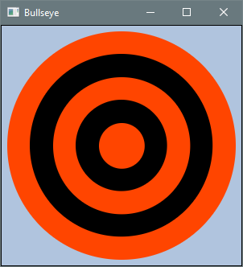

**b. Blender.** Draws three overlapping circles in primary colors with blended colors in the 
intersections. Use `Shape.intersect` for overlaps and call `interpolate` on a `Color` instance to 
blend it with another color.

??? "Output 3.8.5b"
    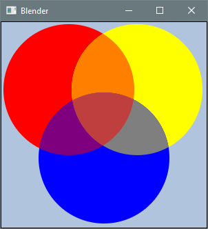

**c. Diagonal Bar.** Draws a six-sided polygon with a thick border.

??? "Output 3.8.5c"
    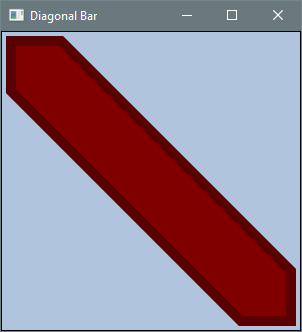

**d. Poisonous Mushroom.** Draws a mushroom cap and stem. The cap is formed by a circle with its 
lower half obscured by a background-colored rectangle so that it appears as a semicircle.

??? "Output 3.8.5d"
    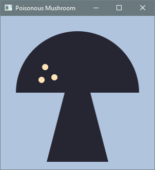

> For Problems e-f, consult the API documentation for `Text` and `Font`. A color has a fourth 
attribute beyond its RGB components — its alpha value (opacity). To create semi-transparent shapes, 
either use the four-argument `Color` constructor or call `interpolate` on a color, blending it 
toward `Color.TRANSPARENT`.

**e. Alpha Values.** Draws three circles with the bottom half of each obscured by a semi-transparent
rectangle labeled with its alpha value.

??? "Output 3.8.5e"
    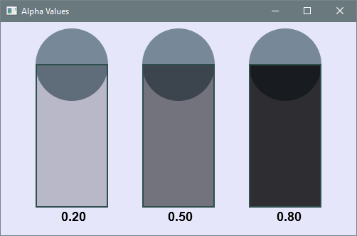

**f. Tow Away Zone.** Draws a circle with a diagonal strike-through over the text “No Parking.” Use 
a circle with a thick stroke and remove its fill by calling `setFill(null)`. Use a rotated rectangle 
for the strike-through.

??? "Output 3.8.5f"
    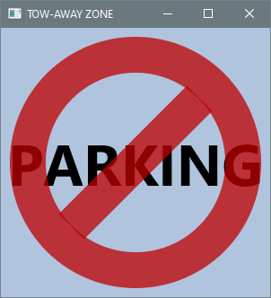

> Problems g–k involve shape classes not introduced in the chapter: `Arc`, `Ellipse`, `Line`, and 
`Polyline`.

**g. Butterfly.** Draws a butterfly. Use `Line` for the antennas.

??? "Output 3.8.5g"
    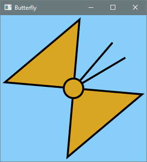

**h. Droid.** Draws a robot. Use `Arc` for the semicircular head and `Line` for the antennas.

??? "Output 3.8.5h"
    

**i. Muffin.** Draws a cat face. Use `Ellipse` for the head, `Line` for the whiskers, and `Arc` for 
the mouth.

??? "Output 3.8.5i"
    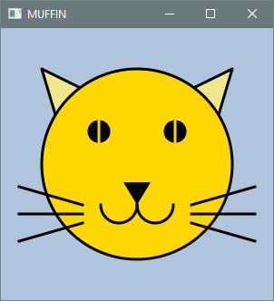

**j. Poisonous Mushroom 2.** Draws a mushroom cap and stem. Use `Arc` for the cap, then combine the 
cap and stem into a single shape using `Shape.union`.

??? "Output 3.8.5j"
    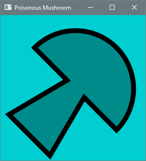

**k. TIE Fighter.** Draws a TIE fighter with a central cockpit (`Ellipse`), two wings (`Polyline`), 
and two struts (`Polygon`) connecting the cockpit to the wings.

??? "Output 3.8.5k"
    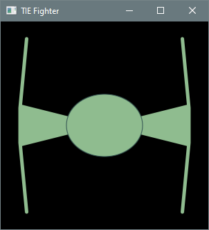

> Problems l-n use `BoxBlur` and `Reflection` effects. Other necessary classes include `Font`, 
`Text`, `Arc`, `Ellipse`, and `Line`.

**l. Planet and Moon.** Draws a planet and a crescent moon using an `Arc` with a `BoxBlur` effect 
for the planet. The crescent is formed via shape intersection.

??? "Output 3.8.5l"
    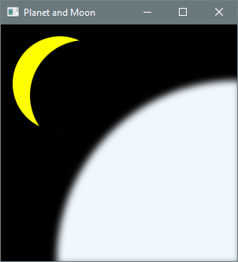

**m. Reflector.** Displays rotated text inside an ellipse with `BoxBlur` and `Reflection` effects.

??? "Output 3.8.5m"
    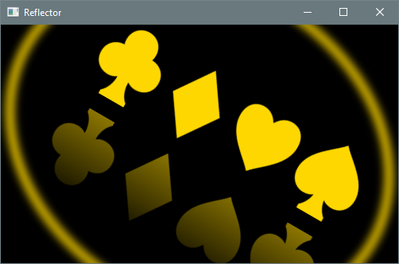

**n. Sands of Time.** Draws an hourglass with falling sand using `Arc` for the sides. Coordinates 
and sizes are fixed for a square canvas; the image does not scale.

??? "Output 3.8.5n"
    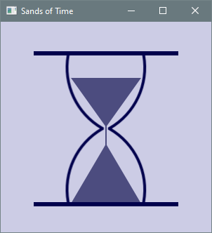
