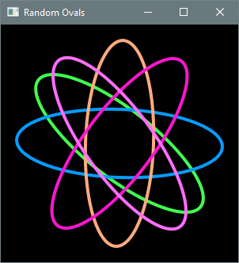

# 4.2 Helper Methods in Practice

**Key terms:** method header, method body, return type, principle of least privilege, parameter, 
local variable

## 4.2.1 Implementing Helper Methods

A method definition consists of a header and a body. The **header** describes how the method can be 
used, while the **body** (enclosed in curly braces) contains the statements to be executed. By 
convention, the body is indented one level beyond the header. Indentation visually signals 
containment: the method belongs to the class, and the statements belong to the method:

```java
class header {
   method header {
      method body
   }
}
```

The method header consists of optional modifiers, a return type, a method name, a parameter list 
enclosed in parentheses, and an optional exception list:

- **Modifiers.** Access modifiers such as `public` and `private` determine the contexts from which a 
method can be called. A `private` method is accessible only within its own class. Helper methods 
should be `private` since they exist only to support other methods of their class. This follows 
the **principle of least privilege**: variables, methods, classes, and other program elements 
should be accessible only to those parts of an application that actually need them. This reduces 
unintended dependencies. The `static` modifier signifies a class method; without this modifier, 
the method is implicitly an instance method.

- **Return type.** The return type specifies the kind of value a method returns. The compiler 
ensures that any use of the returned value is consistent with this declared type. Methods that do 
not return a value still have a return type, indicated by the keyword `void`.

- **Method name.** By convention, method names in Java describe the action performed and are often 
verbs or verb phrases. Method names are written in lower camel case, as in `calculateProfit` and 
`drawCircle`.

- **Parameter list.** **Parameters** name the inputs supplied by the caller. They appear inside 
parentheses as comma-separated type-name pairs. Methods with no inputs have an empty parameter 
list.

- **Exception list.** Some methods must declare exceptions that may be thrown. This will be 
discussed in Chapter 11; until then, no methods appearing in this book will include an exception 
list.

Methods that return a value include a `return` statement specifying that value, which terminates the 
method and returns control to the caller. Void methods may use `return` to exit early; otherwise, 
control returns automatically at the end of the method.

## 4.2.2 Eliminating Redundancy with a Helper Method

Listing 4.2.2 is a modular revision of Listing 4.1.3. A helper method, `rollDice`, rolls three dice 
and returns the result as a string. The `main` method now calls this helper for each player, 
eliminating redundancy. The `@return` tag in a method's doc comment is used to document what the
method returns when this is not clear from the description.

Players could be added with additional calls to `rollDice`. Testing and debugging are simplified 
because the simulation and sorting logic are confined to the helper method.

#### Listing 4.2.2 - [ThreeDiceRoller2.java](https://github.com/drue-coles/cmsc-120/blob/master/code/src/chap04/sect2/ThreeDiceRoller2.java)

Replacing repeated blocks of code with method calls is a direct application of the DRY principle. It 
makes the program shorter, clearer, and less error-prone.

## 4.2.3 Returning Values vs. Writing Output

Note that `rollDice` does not output results directly but instead returns a string containing them. 
This design makes the method more flexible: the caller can display the result, combine it with other 
data, store it, or pass it to another method. Helper methods that return values rather than 
producing output do not commit the program to a particular form of output and therefore remain 
useful as a program evolves.

## 4.2.4 Parameterized Helper Methods

In Listing 4.2.4, `rollDice` is enhanced with a parameter representing the number of sides on a die. 
When the method is called in `main`, the argument's value is copied to the parameter and used by the 
method to generate random numbers.

#### Listing 4.2.4 - [ThreeDiceRoller3.java](https://github.com/drue-coles/cmsc-120/blob/master/code/src/chap04/sect2/ThreeDiceRoller3.java)

This parameterized version of the helper method makes generalizing the program straightforward: the 
`main` method only needs to read user input and pass it to `rollDice`.

## 4.2.5 Local Variables

A **local variable** is one that is declared inside a method. Class constants are an example of 
variables that are not local; other examples will be introduced in Chapter 8.

A local variable exists only while its method is executing, so variables defined in one method are 
not accessible by another. This is why the user's input in Listing 4.2.4 had to be passed to 
`rollDice`; its parameter is also local and ceases to exist when the method returns.

At first, the limited scope of a local variable may seem inconvenient. In reality, it greatly 
simplifies programming, enhancing modularity by preventing unwanted dependencies between methods. As 
a result, methods are self-contained: they can be tested, debugged, and reimplemented without 
affecting any other part of the program.

## 4.2.6 Graphics Example

Listing 4.2.5 is a JavaFX application that draws five randomly colored and rotated ovals centered in 
the viewing area. Implementing this program monolithically would make it longer and more complex, 
since each call to the helper method would have to be replaced by all the statements it contains, 
violating the DRY principle.

#### Listing 4.2.5 - [RandomOvals.java](...)

??? "Output 4.2.5"
    

A helper method creates and styles `Ellipse` objects with the desired properties, which are then 
added to the root node of the scene. A `StackPane` serves as the root node. This container organizes 
children in a back-to-front stack and centers them by default, so explicit positional coordinates 
are unnecessary. The two-argument `Ellipse` constructor assigns the center coordinates to the origin 
by default, but `StackPane` positions children based on its own layout rules.
