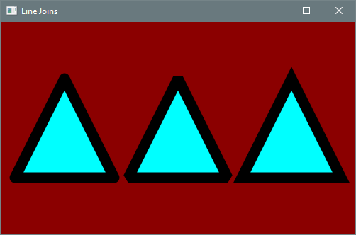
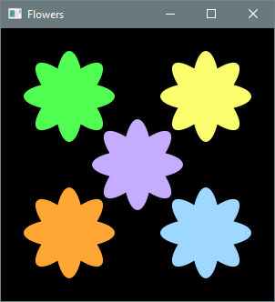
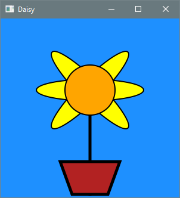

# 4.3 Practice Problems

## 4.3.1 Console Applications

**a. Anagrammer.** Prompts the user for a word and produces an anagram using a helper method that 
splits a string into two parts at a randomly selected index and returns the result of swapping the 
parts. The helper method is applied three times.

??? "Output 4.3.1a"
    ```text
    Enter a word: hippopotamus
    popotamuship
    shippopotamu
    otamushippop
    ```

---

**b. Babylonian Square Root.** Approximates the square root of a user-selected number *n* using the
Babylonian method with *n*/2 as the initial approximation. This method is based on the following 
fact: if a positive number *k* is an approximation to the square root of *n*, then the average of 
*k* and *n/k* is a more accurate approximation. Here a helper method takes two arguments, a 
floating-point number and its approximate square root, and returns the improved approximation. The 
program calls the method five times and displays each result. For the sake of comparison, the actual 
rounded square root is displayed using the static `sqrt` method in the `Math` class.

??? "Output 4.3.1b"
    ```text
    Enter a positive number: 90
    45.0
    23.5
    13.664893617021276
    10.125556968105812
    9.506978456631614
    Approximated square root: 9.506978456631614
    True rounded square root: 9.486832980505138
    ```

## 4.3.2 Graphics Applications

**a. Line Joins.** Displays three centered equilateral triangles, each with a different line join 
style (rounded, beveled, and mitered). The `Polygon` class provides the method `setStrokeLineJoin` 
for specifying how adjacent sides are joined. The argument is a constant declared in the 
`StrokeLineJoin` class.

??? "Output 4.3.2a"
    

Create the center triangle first, then duplicate it twice and translate one copy to the left and the 
other to the right. Implement a helper method that sets the fill color, stroke color, and stroke 
width of a polygon. Call this method from `start` for each triangle.

---

**b. Flowers.** Displays five symmetrical flower shapes as shown below.

??? "Output 4.3.2b"
    

The `start` method does not create these shapes directly; instead, the task is delegated to a helper
method with parameters specifying the location of a flower and the horizontal and vertical radii of 
its petals. The method creates four ellipses differing only in their angle of rotation. These 
ellipses are combined into a single `Shape` using the static `Shape.union` method, filled with a 
randomly generated color, and returned to the caller. The `start` method adds the returned shape to 
the root node. Provide a helper method that generates a color with random RGB values.

---

**c. Daisy.** Displays a daisy in a flower pot as shown below. Each petal is obtained from a helper
method that returns an ellipse centered at a specified location with specified dimensions, rotation 
angle, and fill color. The task of creating the flower pot (a polygon) is delegated to a second 
helper method.

??? "Output 4.3.2c"
    
