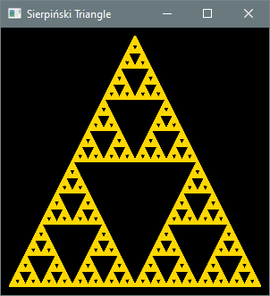

# 6.2 `for` Loops

**Key terms:** loop control variable

## 6.2.1 Syntax and Semantics

Code Fragment 6.2.1a uses a while loop to output a sequence of 20 asterisks. The variable i is 
referred to as a loop control variable: its value is updated in a consistent way in each iteration, 
and once it attains a certain value the loop ends.

```java
int i = 0; 
while (i < 20) {
   System.out.print("*"); 
   i++;
}
```

Not every loop involves the use of a loop control variable. For example, the loop in the 
GamblersRuin program from the previous section continues while the gambler's balance is greater than 
zero, but the balance fluctuates unpredictably. When a loop control variable is used, there are 
three basic steps involved in its management: initializing the variable, testing the condition to 
continue looping (which depends on the variable's current value), and updating the variable. A for 
loop enables the code for these three steps to be written together on the same line for compactness 
and improved readability. Compare the preced-ing code to output a sequence of asterisks with the 
revised version of Code Fragment 6.2.1b using a for loop.

```java
for (int i = 0; i < 20; i++) { 
    System.out.print("*");
} 
```

The general syntax of a for loop is shown in Code Fragment 6.2.1c. The first statement
(S1) typically declares and initializes a loop control variable, although in principle it could be
any valid statement. It is executed once and only once. Next, Boolean expression E (which depends on 
the loop control variable) is evaluated to determine if the loop is to con-tinue. If E is true, the 
body is executed and finally statement S2 is executed (which typically updates the loop-control 
variable). The flow of execution then returns to the evaluation step.

```java
for (S1; E; S2) { 
   // body
} 
```
As another illustration, suppose s is a string reference and you want to append every second 
character to another (initially empty) string t. Code Fragment 6.2.1d performs this task.

```java
String t = ""; 
for (int i = 0; i < s.length(); i += 2) { 
    t += s.charAt(i);
}
```

Listing 6.2.1a is a revision of the Summer program from the previous section using a for loop 
instead of a while loop.

#### Listing 6.2.1a - [Summer.java](https://github.com/drue-coles/cmsc-120/blob/master/code/src/chap06/sect2/Summer.java)
``` java title="Summer.java"
--8<-- "code/src/chap06/sect2/Summer.java"
```

A less trivial but still simple application is given by Listing 6.2.1b, which approximates the 
value 
of π by calculating partial sums of an infinite series familiar to students of calculus. The Unicode 
character for the Greek letter π is used as a variable name and as part of the program’s output. 
(See Section 3.1.6 for a review of Unicode.)

#### Listing 6.2.1b - [PiApproximator.java](https://github.com/drue-coles/cmsc-120/blob/master/code/src/chap06/sect2/PiApproximator.java)
``` java title="PiApproximator.java"
--8<-- "code/src/chap06/sect2/PiApproximator.java"
```

??? "Output 6.2.1b"
    ```text
      Leibniz series approximation (100,000,000 terms): 3.141592643589326
    Double-precision floating-point value nearest to π: 3.141592653589793
    ```

## 6.2.2 Case Study: Game of Craps

Craps is an old single-player dice game that is still played in casinos. In fact, it offers the 
player the highest probability of winning among all common casino games. That probability is less 
than 50% of course, but as we will see later, it is close. Chapter 5 presented several versions of a 
program that simulates the first roll of the game, but now with loops in our repertoire, we can carry 
out the game to its conclusion. Listing 6.2.2a is a complete Craps-playing program. The rules are 
described in the class documentation.

#### Listing 6.2.2 - [Craps.java](https://github.com/drue-coles/cmsc-120/blob/master/code/src/chap06/sect2/Craps.java)
``` java title="Craps.java"
--8<-- "code/src/chap06/sect2/Craps.java"
```

??? "Output 6.2.2a"
    ```text
    2 + 5 = 7 
    Natural. You win.
    ```

??? "Output 6.2.2b"
    ```text
    1 + 2 = 3 
    Craps. You lose.
    ```

??? "Output 6.2.2c"
    ```text
    3 + 2 = 5 
    The point is 5. 
    1 + 5 = 6 
    3 + 1 = 4 
    4 + 6 = 10 
    4 + 1 = 5 
    You rolled the point. You win.
    ```

??? "Output 6.2.2d"
    ```text
    5 + 5 = 10 
    The point is 10. 
    3 + 1 = 4 
    1 + 5 = 6 
    2 + 2 = 4 
    4 + 1 = 5 
    1 + 6 = 7 
    Seven out. You lose.
    ```

## 6.2.3 Case Study: Fractal Generator

A Sierpinski triangle [link] is a fractal [link] that can be constructed in the following way. 

Start with an equilateral triangle. Partition it into four smaller congruent equilateral triangles 
and remove the one in the center. Repeat this process for each of the remaining triangles.
The first five iterations of this construction are shown in Figure 6.2.3a. 

Amazingly, the same result can be obtained using randomness in a way that is much easier to 
program. Start by fixing three corners of a triangle, and then: 

Pick any point in the triangle and call it the current point. 

Choose a corner at random move the current point halfway to it. 3. 

Draw the current point and return to step 2. 

You would probably not expect anything other than an unstructured smear of dots to arise from 
this process, but after many repetitions the very delicate structure of a Sierpinski triangle 
begins to emerge. Listing 6.2.3a is a JavaFX application that performs these steps to draw the 
fractal. This application is a bit longer and more involved than earlier ones, but the documentation 
clarifies the coding logic. You might enjoy experimenting with the dot size and the number of dots.

#### Listing 6.2.3 - [Fractal.java](https://github.com/drue-coles/cmsc-120/blob/master/code/src/chap06/sect2/Fractal.java)
``` java title="Fractal.java"
--8<-- "code/src/chap06/sect2/Fractal.java"
```

??? "Output 6.2.3"

