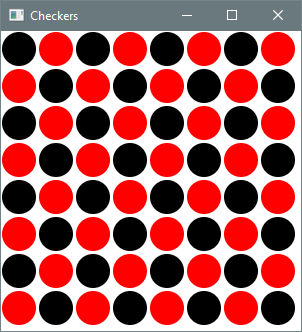

# 6.4 Nested Loops

**Key terms:** nested loop

## 6.4.1 Basic Concepts

A **nested loop** is one contained in the body of another loop. One common use of such a structure 
is to output tabular data. The code below outputs a 5 x 7 multiplication table. The outer loop 
control variable (`i`) ranges from 1 to 5. For each value of `i`, the inner loop control variable 
(`j`) ranges from 1 to 7, printing the product of `i` and `j` at each step. The second call to 
`println` is part of the outer loop body — it outputs a newline character at the end of each row of 
the table. This process is depicted by the flowchart in Figure 6.4.1.

```java
for (int i = 1; i <= 5; i++) { 
    for (int j = 1; j <= 7; j++) { 
        System.out.printf("%3d", i * j);
    }
    System.out.println(); 
}
```

??? "Output"
    ```text
    1  2  3  4  5  6  7 
    2  4  6  8 10 12 14 
    3  6  9 12 15 18 21 
    4  8 12 16 20 24 28 
    5 10 15 20 25 30 35
    ```

Figure 6.4.1: [Flowchart](images/figure6.4.1.png)

## 6.4.2 Case Study: Winning Combinations

The simplicity of the Sum Game made it ideal for introducing the concept of a Monte Carlo simulation 
in Section 6.3.1. However, the probability can be calculated directly and exactly by enumerating 
all three-die combinations and counting those that satisfy the winning criterion. Listing 6.4.2 
performs this task using three nested loops, each iterating over the possible values of one die.

#### Listing 6.4.2 - [SumGame.java](https://github.com/drue-coles/cmsc-120/blob/master/code/src/chap06/sect4/SumGame.java)
``` java title="SumGame.java"
--8<-- "code/src/chap06/sect4/SumGame.java"
```

??? "Output 6.4.2"
    ```text
    Calculating the probability of winning the Sum Game...
    Number of winning rolls: 45 
    Number of possible rolls: 216 
    Probability of winning: 0.2083
    ```

For a visual trace of the nested looping, the program could be modified to output each three-die 
combination as it occurs:

```java
for (int d3 = 1; d3 <= sides; d3++) {
    System.out.printf("%n %d-%d-%d", d1, d2, d3); // output current combination
    if (d1 == d2 + d3 || d2 == d1 + d3 || d3 == d1 + d2) {
        winningRolls++;
        System.out.println(" ★"); // mark winning combination
    }
}
```

??? "Partial Output of Code Fragment"
    ```text
    1-1-1
    1-1-2 ★
    1-1-3
    1-1-4
    1-1-5
    1-1-6
    1-2-1 ★
    1-2-2
    1-2-3 ★
    1-2-4
    ```

## 6.4.3 Case Study: Drawing a Checkerboard

The graphics application in Listing 6.4.3 uses nested loops to draw a board filled with 
alternating red and black checkers. The outer loop repeats once for each row of the board. Within a 
row, the inner loop repeats once for each column. Each (row, column) combination is checked to 
determine the correct color of the corresponding checker.

#### Listing 6.4.3 - [Checkers.java](https://github.com/drue-coles/cmsc-120/blob/master/code/src/chap06/sect4/Checkers.java)
``` java title="Checkers.java"
--8<-- "code/src/chap06/sect4/Checkers.java"
```

??? "Output 6.4.3"
    
