# 6.5 Practice Problems

## 6.5.1 Basic Console Applications

**a. Big Summer.** Calculates the sum of the positive integers from 1 up to a user-specified limit.

??? "Output 6.5.1a"
    ```text
    Enter a positive integer: 123456789
    1 + 2 + 3 + ... + 123,456,789 = 7,620,789,436,823,655
    ```

Adapt Listing 6.2.1a using `BigInteger` to avoid overflow.

---

**b. Capybara.** Plays the game of Capybara. The player repeatedly rolls a pair of dice and wins a 
dollar amount equal to the sum. Play continues until a sum of 7, 8, or 9 is rolled, at which point 
the game ends. If the first roll is 7, 8, or 9, the player wins nothing.

??? "Output 6.5.1b"
    ```text
    Welcome to Capybara. 
    4 + 6 = 10 
    2 + 3 = 5 
    3 + 3 = 6 
    1 + 6 = 7 
    You win $21.
    ```

---

**c. Leibniz Accuracy.** Outputs the approximation of π obtained by summing the first *n* terms of 
the Leibniz series shown in Listing 6.2.1b, for *n* = 10, 100, 1000, and so on, up to a billion. 
Also outputs the accuracy of each approximation — the number of consecutive correct digits after 
the decimal point.

??? "Output 6.5.1c"
    ```text
    π = 4 - 4/3 + 4/5 - 4/7 + ...
    
            Terms     Result    Accuracy 
               10  3.2323158094     0 
              100  3.1514934011     1 
            1,000  3.1425916543     2 
           10,000  3.1416926436     3 
          100,000  3.1416026535     3 
        1,000,000  3.1415936536     5 
       10,000,000  3.1415927536     6
      100,000,000  3.1415926636     7
    1,000,000,000  3.1415926546     8
    ```

Implement a helper method that converts two `double` values to strings, then iterates over the
characters to locate the first position at which they differ.

---

**d. Greatest Substring.** Prompts the user for a string of digits and an integer *k* ≤ 9, and 
outputs the greatest *k*-digit substring.

??? "Output 6.5.1d"
    ```text
    Enter a string of digits and an integer ≤ 9: 9093286194516827995 4
    Greatest 4-digit substring: 9451
    ```

Hint: convert each *k*-digit substrings to an `int` using `Integer.parseInt`.

---

**e. Distinct Digits.** Prompts the user to enter a four-digit year and outputs the first 
subsequent year with four different digits.

??? "Output 6.5.1e"
    ```text
    Enter a four-digit year: 1987
    The first subsequent year with four different digits: 2013
    ```

A straightforward approach converts the year to a string and compares each pair of characters using 
a nested loop. Alternatively, for each position *k*, the digit can be checked for inclusion in the 
substring starting at index *k* + 1.

---

**f. Middle Square.** Outputs five pseudorandom numbers generated from a user-selected seed using 
the *middle square method*. Let *n* be the number of digits in the seed. To generate the first 
pseudorandom number, square the seed, convert the result to a string, and left-pad it with a zero if 
necessary so that it contains exactly 2*n* digits. The first pseudorandom number is the substring of 
length *n* beginning at index *n*/2 (integer division). This value becomes the next seed, and the 
process repeats.

Figure 6.5.1f illustrates this process with an initial seed of 1352. 

Figure 6.5.1f: [Middle Square Illustration](images/figure6.5.1f.png)

In the preceding example, *n* = 4 and 1352<sup>2</sup> = 1827904. The result is prepended with a 
zero so that it has 2*n* = 8 digits: 01827904. The *n*-digit substring beginning at index *n*/2 is  
8279, which becomes the next seed.

??? "Output 6.5.1f-1"
    ```text
    Initial seed: 1352
    Output 1: 8279 
    Output 2: 5418 
    Output 3: 3547 
    Output 4: 5812 
    Output 5: 7793 
    ```

??? "Output 6.5.1f-2"
    ```text
    Initial seed: 12345
    Output 1: 523990 
    Output 2: 565520 
    Output 3: 812870 
    Output 4: 757636 
    Output 5: 012308 
    ```

---

**g. Back and Forth.** A robot moves along a straight line, starting at point *A*. It walks to point 
*B* at a constant speed of 1 unit per second. Upon reaching *B*, it immediately turns around and 
walks back to *A* at the same speed. This process repeats indefinitely and gives the robot a sense 
of fulfillment.

Write a program that prompts the user for positive integers *A* and *B*, and time *T* in seconds, 
and outputs the location of the robot at time *T*. 

??? "Output 6.5.1g-1"
    ```text
    Enter A, B, and T: 5 13 27 
    Location at time 27: 10
    ```

??? "Output 6.5.1g-2"
    ```text
    Enter A, B, and T: 1 500 12345
    Location at time 12345: 370
    ```

One approach is to simulate the robot's motion by incrementing or decrementing its position once per 
second for *T* seconds. This works well for moderate values of *T*, but becomes impractical when 
*T* is very large. For an extra challenge, solve the problem mathematically (without loops) 
by exploiting the periodic nature of the robot's motion. This approach works efficiently even for 
arbitrarily large values of *T*.

??? "Output 6.5.1g-3"
    ```text
    Enter A, B, and T: 3 97 12345678987654321
    Location at time 12345678987654321: 84
    ```

---

**h. Factorial Digit Sum.** The factorial of *k*, denoted *k*!, is the product of positive integers 
from 1 to *k*. For example, 6! = 6 × 5 × 4 × 3 × 2 × 1 = 720.

Write a program that prompts the user for a positive integer *k* and outputs the sum of the digits 
in the factorial of *k*.  

??? "Output 6.5.1h-1"
    ```text
    Enter a positive integer: 6
    The digits of 6! sum to 9.
    ```

??? "Output 6.5.1h-2"
    ```text
    Enter a positive integer: 12345
    The digits of 12345! sum to 189000.
    ```

Adapted from Project Euler, Problem 20 (https://projecteuler.net/problem=20).

---

**i. Euclidean Cake.** Happy birthday! Your best friend has baked a cake for you. It’s rectangular, 
your favorite shape. You have resolved to eat just one slice each day, and it must be square —
tastes better that way. Specifically, each day you will eat the largest square slice that can be 
removed with a single straight cut. 

Suddenly you have a great idea: you can write a program that prompts the user for the dimensions of 
a cake and outputs the size of the remaining cake after each successive slice.

??? "Output 6.5.1i-1"
    ```text
    Enter dimensions of cake: 8 12 
    Size of cake on day 1: 8 x 12 
    Size of cake on day 2: 4 x 8 
    Size of cake on day 3: 4 x 4 
    The cake is gone.
    ```

??? "Output 6.5.1i-2"
    ```text
    Enter dimensions of cake: 8 13 
    Size of cake on day 1: 8 x 13 
    Size of cake on day 2: 5 x 8 
    Size of cake on day 3: 3 x 5 
    Size of cake on day 4: 2 x 3 
    Size of cake on day 5: 1 x 2 
    Size of cake on day 6: 1 x 1 
    The cake is gone. 
    ```

??? "Output 6.5.1i-3"
    ```text
    Enter dimensions of cake: 42 30 
    Size of cake on day 1: 30 x 42 
    Size of cake on day 2: 12 x 30 
    Size of cake on day 3: 12 x 18 
    Size of cake on day 4: 6 x 12 
    Size of cake on day 5: 6 x 6 
    The cake is gone.
    ```

The user may enter the length and width in either order, but the program displays all dimensions 
with the shorter side first.

---

**j. Babylonian Square Root.** Various mathematical techniques are known for approximating square 
roots. One such technique, called the Babylonian method, is based on the following idea: if *k* is 
an approximation of the square root of *n*, then the average of *k* and *n*/*k* is a better 
approximation.

Write a program that approximates the square root of a user-selected number *n* by starting with 
*n*/2 as an initial approximation and repeatedly applying the Babylonian update rule until 
successive approximations are equal (within floating-point precision). This indicates that further 
iteration produces no change in the stored `double` value.

??? "Output 6.5.1j-1"
    ```text
    Enter a positive number: 2 
    1. 1.500000 
    2. 1.416667 
    3. 1.414216 
    4. 1.414214
    5. 1.414214
    ```

??? "Output 6.5.1j-2"
    ```text
    Enter a positive number: 23.6 
    1. 6.900000 
    2. 5.160145 
    3. 4.866830 
    4. 4.857991 
    5. 4.857983 
    6. 4.857983
    ```

---

**k. Exam Strategy.** Course grades are determined by four exams, each consisting of 100 questions 
worth a single point. The average exam score is converted to a letter grade according to the 
following scale:

- A = [90, 100]
- B = [80, 90)
- C = [70, 80)
- D = [60, 70)
- F = [0, 60)
  
So far, you have taken three exams. You have prepared well for the fourth exam and you are confident 
that you can answer every question correctly, but you do not want to waste your time answering more 
questions than necessary. 

Write a program that prompts the user for the first three exam scores and outputs the smallest 
number of questions that must be answered correctly on the fourth exam to earn the highest 
attainable letter grade. If passing the course is impossible, the program instead advises the user 
to skip the fourth exam.

??? "Output 6.5.1k-1"
    ```text
    First three exam scores: 81 82 83
    Answer 74 questions on the fourth exam to earn a grade of B.
    ```

??? "Output 6.5.1k-2"
    ```text
    First three exam scores: 50 66 77
    Answer 87 questions on the fourth exam to earn a grade of C. 
    ```

??? "Output 6.5.1k-3"
    ```text
    First three exam scores: 90 93 87
    Answer 90 questions on the fourth exam to earn a grade of A.
    ```

??? "Output 6.5.1k-4"
    ```text
    First three exam scores: 91 23 25 
    Skip the fourth exam. 
    ```

??? "Output 6.5.1k-5"
    ```text
    First three exam scores: 45 50 60
    Answer 85 questions on the fourth exam to earn a grade of D. 
    ```

---

**l. Hill Workout.** Distance runners often build strength and stamina by running hill repeats. A 
runner starts at the bottom of a hill of length *n* miles, runs uphill *x* miles, immediately turns 
around and runs downhill *y* miles, then repeats this pattern until reaching the top of the hill.

Write a program that prompts the user for *x*, *y*, and *n*, and outputs the total distance run 
during the workout, including both the uphill and downhill portions.

??? "Output 6.5.1l-1"
    ```text
    Enter x, y and n: 5 3 7 
    Workout distance: 13 miles.
    ```

??? "Output 6.5.1l-2"
    ```text
    Enter x, y and n: 3 1 8 
    Workout distance: 14 miles.
    ```

---

**m. Hailstones.** A hailstone sequence starts with a positive integer and continues according to 
the following rule: if the number is even, divide it by 2; otherwise, multiply it by 3 and add 1. 
The rule is applied repeatedly until the number 1 is reached. For example, the hailstone sequence 
starting at 6 is 6, 3, 10, 5, 16, 8, 4, 2, 1. The name *hailstone sequence* comes from the way the 
terms appear to rise and fall like hail in a storm before hitting the ground.

Is every hailstone sequence finite? In other words, does every sequence eventually reach 1? This is
a famous open question. Every starting value tested so far eventually reaches 1, but nobody has been 
able to prove that this must always be the case.

Write a program that prompts the user for a positive integer *n* and outputs the smallest starting 
value whose hailstone sequence contains exactly *n* terms.

??? "Output 6.5.1m-1"
    ```text
    Enter a positive integer: 9
    The first hailstone sequence with 9 terms starts at 6. 
    ```

??? "Output 6.5.1m-2"
    ```text
    Enter a positive integer: 100
    The first hailstone sequence with 100 terms starts at 27. 
    ```

??? "Output 6.5.1m-3"
    ```text
    Enter a positive integer: 500
    The first hailstone sequence with 500 terms starts at 3,030,267.
    ```

---

**n. Digit Sum Chain.**  Choose a positive integer. Replace it with the sum of its digits, and 
repeat this process until a single digit remains. The resulting sequence is called a *chain of 
digit sums*. 

Write a program that prompts the user for a positive integer and outputs the corresponding chain of 
digit sums.

??? "Output 6.5.1n-1"
    ```text
    Enter a positive integer: 879 
    Chain of digit sums: 879 24 6
    ```

??? "Output 6.5.1n-2"
    ```text
    Enter a positive integer: 557788999 
    Chain of digit sums: 557788999 67 13 4
    ```

---

**o Safe Password**. Prompts the user for a password and outputs a message indicating whether it is 
safe. for this problem, a safe password is one that satisfies the following conditions. 

- It contains at least eight characters.
- At least one character is a digit. 
- At least one character is a lowercase letter of the alphabet. 
- At least one character is an uppercase letter of the alphabet. 
- At least one character is neither a letter nor a digit. 

Conditions (2)–(5) can be tested using static methods in the `Character` class.

??? "Output 6.5.1o-1"
    ```text
    Enter password: SafePass8 
    SafePass8 is NOT a safe password.
    ```

??? "Output 6.5.1o-2"
    ```text
    Enter password: Bb5? 
    Bb5? is NOT a safe password.
    ```

??? "Output 6.5.1o-3"
    ```text
    Enter password: quokka3+ 
    quokka3+ is NOT a safe password.
    ```

??? "Output 6.5.1o-4"
    ```text
    Enter password: PSWRD#17 
    PSWRD#17 is NOT a safe password.
    ```

??? "Output 6.5.1o-5"
    ```text
    Enter password: one+one=two 
    one+one=two is NOT a safe password.
    ```

??? "Output 6.5.1o-6"
    ```text
    Enter password: Safe@123 
    Safe@123 is a safe password.
    ```

---

**p. Pace Band.** Suppose you are running a 5-mile road race and you want to maintain a steady pace 
of 6:25 per mile. If you start your watch when the gun sounds, the time on your watch at the first 
mile marker would be 6:25; at the second mile marker, your watch would read 12:50; at the third, 
19:15, and so on. 

Prior to GPS watches, some runners wore printed times on a so-called *pace band* around their 
wrists. This allowed them to track progress at each mile marker without mental calculation.

Write a program that prompts the user for a race distance in miles and a target pace in M:SS format, 
and outputs the corresponding pace band times at each mile marker. The distance of a race may not be
a whole number of miles (a marathon, for example, is 26.2 miles), but only whole-mile progress is
required. The ran distance can therefore be assumed to be an integer. 

??? "Output 6.5.1p-1"
    ```text
    Enter distance in miles: 5 
    Enter target pace: 6:25 
    06:25 
    12:50 
    19:15
    25:40
    32:05
    ```

??? "Output 6.5.1p-2"
    ```text
    Enter distance in miles: 10 
    Enter target pace: 6:59 
    06:59 
    13:58 
    20:57 
    27:56 
    34:55 
    41:54 
    48:53 
    55:52
    01:02:51 
    01:09:50
    ```

Use the `LocalTime` class and its methods for adding minutes or seconds. Output the times in MM:SS 
or HH:MM:SS format.

---

**q. Happy Numbers.** Given a positive integer n, we can produce a sequence s(n) by replacing n with 
the sum of the squares of its digits, and repeatedly applying this process for each resulting
number. We say that n is happy if s(n) reaches 1. For example, 32 is a happy number since s(32) = 
(32. 13, 10, 1).

The first few happy numbers are 1, 7, 10, 13, 19, 23, and 28. 

The number 38, on the other hand, is sad (not happy). To see why, look at the first ten terms of the 
sequence: 38, 73, 58, 69, 145, 42, 20, 4, 16, 37. The next number would be 3^2 + 7^2 = 58, which 
appears earlier in the sequence, so we have entered the endless cycle (58, 69, 145, 42, 20, 4, 16, 
37). It can be shown that every sad number enters this same cycle, which provides an easy test to 
determine if a number n is happy or sad: just pick one of the numbers in the cycle, say 4, and 
generate the terms of s(n) until reaching either 1 (happy) or 4 (unhappy).

See https://en.wikipedia.org/wiki/Happy_number.

This program prompts the user for a positive integer k and outputs the k-th happy number.


Given a positive integer *n*, form a sequence by replacing *n* with the sum of the squares of its 
digits, and repeatedly applying this process to each resulting number. The number *n* is called 
*happy* if the sequence reaches 1. For example, the sequence beginning at 32 is 32, 13, 10, 1, so 
32 is happy. The first few happy numbers are 1, 7, 10, 13, 19, 23, and 28.

The number 38, on the other hand, is *sad*. Its sequence begins 38, 73, 58, 69, 145, 42, 20, 4, 16, 
37, after which the value 58 reappears, so the sequence enters the repeating cycle (58, 69, 145, 42, 
20, 4, 16, 37). In fact, every sad number eventually enters this same cycle. Therefore, to determine 
whether a number is happy, it suffices to generate terms until reaching either 1 (happy) or 4 (sad).

Write a program that prompts the user for a positive integer *k* and outputs the *k*-th happy 
number.

??? "Output 6.5.1q-1"
    ```text
    Enter a positive integer: 7
    28
    ```

??? "Output 6.5.1q-2"
    ```text
    Enter a positive integer: 70
    446
    ```

*For more about happy numbers, see the 
[Wikipedia article on happy numbers](https://en.wikipedia.org/wiki/Happy_number).*

---

**r. Rule 184.** Imagine a circular sequence of the symbols **L** and **R**, where each **L** looks
to the left and each **R** looks to the right. Two or more consecutive **L**s form an *L-block*,
and similarly for *R-blocks*.

Repeatedly apply the following update rule: whenever two adjacent symbols are looking at each other,
they swap places. All swaps occur simultaneously. The following example illustrates one update.

```text
R L L R L L R R
L R L L R L R R
```

Starting from any sequence and repeatedly applying the update rule, one of three outcomes is
guaranteed:

1. If there are more **L**s than **R**s, the final sequence contains an *L-block* but no *R-blocks*.
2. If there are more **R**s than **L**s, the final sequence contains an *R-block* but no *L-blocks*.
3. If there are equally many **L**s and **R**s, the final sequence contains no blocks.

The following example begins with a majority of **L**s. After three updates, the final sequence is
reached.

```text
R R L L L L L R R
R L R L L L L R R
L R L R L L L R R
R L R L R L L R L
```

Remember that the sequence is circular. For example, in the third line above, the **L** at the
beginning and the **R** at the end are looking at each other. Likewise, the first and last symbols
of **LRLRL** form an *L-block*.

Write a program that prompts the user for a start sequence, repeatedly applies the update rule until 
the final sequence is reached, and outputs the final sequence. For convenience, sequences are 
entered and displayed without spaces.

??? "Output 6.5.1r-1"
```text
Start sequence: RRLLLLLRR
Final sequence: RLRLRLLRL
```

??? "Output 6.5.1r-2"
```text
Start sequence: RRRRLLLL
Final sequence: RLRLRLRL
```

??? "Output 6.5.1r-3"
```text
Start sequence: LLRRRLLRLLRLRRL
Final sequence: RLRLRLRLLRLRLRL
```

Rule 184 can model traffic flow and particle systems. Curious readers may enjoy the Wikipedia
articles on
<a href="https://en.wikipedia.org/wiki/Rule_184">Rule 184</a> and
<a href="https://en.wikipedia.org/wiki/Elementary_cellular_automaton">elementary cellular automata</a>.

## 6.5.2 Basic Graphics Applications

**a. Rainbow Circles.** Draws a series of concentric circles with random colors.

??? "Output 6.5.2a"
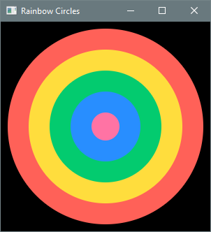

---

**b. Petals.**  Draws a petal-like structure by rotating identical ellipses about their centers at 
regular intervals.


??? "Output 6.5.2b"
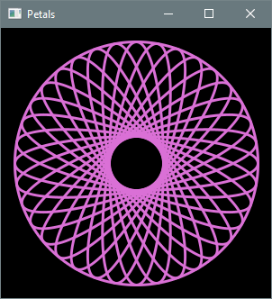

For an extra challenge, experiment with the use of `RotateTransition` and/or `ScaleTransition` to 
animate individual petals.

---

**c. Interleaved Squares.**  Draws a series of centered squares with decreasing side lengths. The 
fill color alternates between red and green, and red are rotated by squares by 45 degrees.

??? "Output 6.5.2c-1"
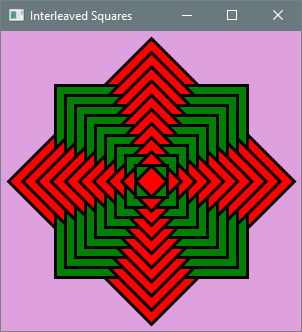

For an extra challenge, experiment with the use of `RotateTransition` to animate the individual 
squares.

??? "Output 6.5.2c-2"
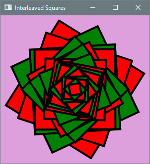

---

**d. Color Bars.** Draws a sequence of randomly colored vertical bars with their bases along the 
bottom edge of the scene. The height of each bar is chosen randomly between a fixed minimum and the 
height of the scene. The bars all have the same width and are separated by a fixed gap.

??? "Output 6.5.2d"


---

**e. Random Tower.** Draws a tower of rectangles spanning the scene from top to bottom. Each 
rectangle has the same height, while its width is chosen randomly between a fixed minimum and the 
width of the scene.

??? "Output 6.5.2e"
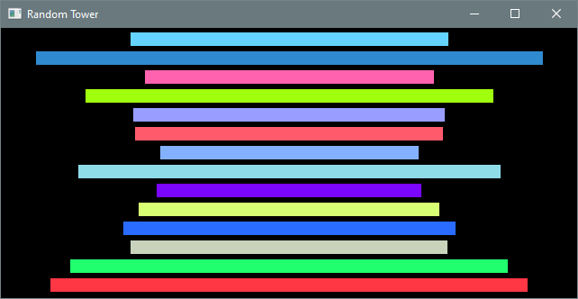

---

**f. Around the Sun.**  Draws a top-down view of the Solar System with all the planets moving in 
circular orbits around the Sun. 

??? "Output 6.5.2f"
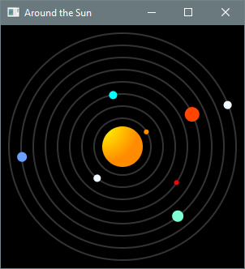

Use `PathTransition` to animate the planets along their orbits. The distances and planet sizes are 
not to scale (and real planetary orbits are elliptical), but the relative orbital speeds should be. 
Look up the orbital periods (or speeds) of the planets and scale them proportionally so that Mercury 
completes one orbit every second.

One of the Chapter 7 practice problems invites you to simplify your solution to this problem using 
arrays.

---

**g. Graphical π Approximator.** Displays a graphical representation of the Monte Carlo simulation 
used to approximate π in Section 6.3.3. Random points are generated within a square scene. 
Different colors are used to distinguish points within the circumscribed quarter circle from 
those outside it.

??? "Output 6.5.2g-1"
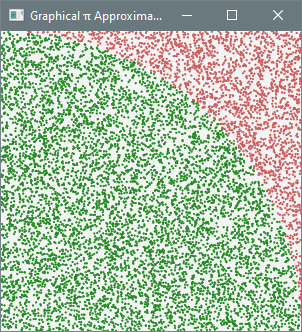

The fraction of points inside the quarter circle approximates π/4, so multiplying that fraction by
four approximates π itself. Display this information in an alert dialog:

??? "Output 6.5.2g-2"
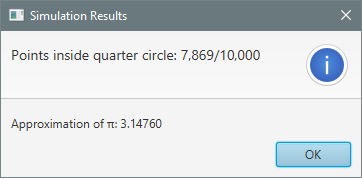

The following helper method can be used to display the results in an alert dialog:

```java
/**
 * Creates and returns an alert dialog with the simulation results.
 */
private static Alert getAlert(int pointsInQuarterCircle, int totalPoints) {
    // Consult the API documentation for the Alert class.
}
```
Call the method from `start` as follows:

```java
// display simulation results
Alert alert = getAlert(pointsInQuarterCircle, totalPoints);
alert.showAndWait();
```

---

**h. Down the Drain.** Animates a dot moving along a spiral path.

??? "Output 6.5.2h"
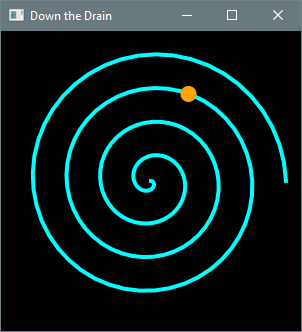

Use `PathTransition` for the animation. Represent the spiral as a `Polyline` whose vertices lie on
imaginary circles of gradually increasing radius. Constructing the polyline involves elementary
trigonometry, but the following code can be used without understanding the mathematics:

```java
 /**
 * Creates and returns a polyline representing a spiral.
 *
 * @param x x-coordinate of center
 * @param y y-coordinate of center
 * @param n number of revolutions
 * @param rStep increase in radius between successive vertices
 * @param aStep increase in angle (in degrees) between successive vertices 
 */
private static Polyline getSpiral(int x, int y, int n, double rStep, double aStep) {
    Polyline spiral = new Polyline();
    double radius = 0;
    for (double angle = 0; angle < 2 * n * Math.PI; angle += Math.toRadians(aStep)) {
        double u = x + radius * Math.cos(angle);
        double v = y + radius * Math.sin(angle);
        spiral.getPoints().addAll(u, v);
        radius += rStep;
    }
    return spiral;
}

```

## 6.5.3 Monte Carlo Simulations


**a. Roulette.** An American roulette wheel has 38 equally sized slots. Two are green, 18 are red,
and 18 are black. A common wager is to bet $1 on red. If the ball lands on a red slot, the player
receives the original dollar back plus another dollar. Otherwise, the player loses the dollar.

Write a Monte Carlo simulation that estimates the expected payout. 

??? "Partial output 6.5.3a"
    ```text
    Spin the roulette wheel and bet a dollar on RED.
    Simulating 100,000,000 trials...
    Expected payout:
    ```

The correct result is slightly negative, indicating a small expected loss.

---

**b. Three of a Kind.** Estimates the probability of rolling three of a kind with four dice. A 
positive outcome includes the case when all four dice are the same.

??? "Partial output 6.5.3b"
    ```text
    Rolling four dice 10,000,000 times...
    Probability of rolling three of a kind:
    ```

The probability is between 9 and 10 percent.

---

**c. Thor vs. Zeus.** Thor has nine 4-sided dice with faces numbered from 1 to 4. Zeus has six 
6-sided dice with faces numbered from 1 to 6. They roll their dice and add up the numbers obtained. 
The highest total wins. The game is a draw if the totals are equal.

Write a Monte Carlo simulation that estimates the probability of victory for Thor.

??? "Partial output 6.5.3c"
    ```text
    Simulating Thor vs. Zeus 100,000,000 times... 
    Probability of victory for Thor:
    ```

The true probability is between 55 and 60 percent. 

---

**d. Seven and Eleven.** Estimates the expected number of rolls of a pair of dice until sums of 
7 and 11 have each occurred at least once. 

??? "Partial output 6.5.3d"
    ```text
    Rolling until sums of 7 and 11 have each occurred at least once.
    Repeating 10,000,000 times... 
    Expected number of rolls: 
    ```

The true expected number of rolls is between 15 and 20.

---

**e. Capybara Payout.** Estimates the expected payout for the game of Capybara. The player rolls a 
pair of dice and wins the sum in dollars. Play continues until a sum of 7, 8, or 9 is rolled, ending 
the game without a payout for that roll.

??? "Partial output 6.5.3e"
    ```text
    Playing Capybara 100,000,000 times... 
    Expected payout: $
    ```

The true expected payout is between $8 and $9.

---

**f. Okapi Payout.** Estimates the expected payout for the game of Okapi. The player rolls three 
dice and receives a payout determined by the following rules.

- If the three numbers are the same, the player wins the sum of those three numbers.
- If exactly two of the numbers are the same, the player wins the sum of those two numbers.
- For three different numbers, the player wins nothing.

??? "Partial output 6.5.3f"
    ```text
    Playing Okapi 100,000,000 times... 
    Expected payout: $
    ```

The true expected payout is between $3 and $4.

---

**g. Quetzal.** Estimates the expected payout for the game of Quetzal. The player rolls three dice.
The payout is equal to the number of even rolls multiplied by the sum of the even rolls, plus the
number of odd rolls multiplied by the sum of the odd rolls.

For example, a roll of 2-5-4 consists of two even rolls (2 and 4) and one odd roll (5), so the 
payout is 2 × (2 + 4) + 1 × 5 = $17. A roll of 3-1-5 consists of no even rolls and three odd rolls,
so the payout is 0 + 3 × (3 + 1 + 5) = $27.

??? "Partial output 6.5.3g"
    ```text
    Playing Quetzal 100,000,000 times...
    Expected payout: $
    ```

The true expected payout is between $20 and $22.

---

**h. Colliding Kings.** Two kings are placed on opposite corners of a standard chessboard. The 
black king starts at A1 (bottom left) and the white king starts at H8 (top right). Each second, the 
kings move simultaneously. The black king moves one square up or one square right (if both moves are 
possible, it chooses randomly). The white king moves one square down or one square left (also 
choosing randomly when both moves are possible).

The kings are said to *collide* if they land on the same square at the same time.

Write a Monte Carlo simulation to estimate the probability of a collision.

??? "Output 6.5.3g"
    ```text
    Simulating the moving kings 10,000,000 times...
    Probability of collision:
    ```

The probability is between 20 and 21 percent.

---

**i. Relatively Prime.** Two integers that have no common divisor greater than 1 are said to be 
relatively prime. 12 and 15 are not relatively prime since 3 is a common divisor, but 12 and 25 are 
relatively prime. It turns out that the probability of two random positive integers being relatively 
prime is 6/π2. 

Implement a Monte Carlo simulation to confirm this mathematical fact. The user enters a positive 
integer n and the simulation generates random pairs of positive n-digit integers. Display the 
fraction of relatively prime pairs and the exact rounded value of 6/π2  for comparison.

Display both numbers with 5 digits after the decimal point. Implement a helper method that returns a
BigInteger constructed with a given number of random digits. You can compute the greatest common 
divisor of two BigIntegers using the gcd method of the class.

??? "Output 6.5.3i-1"
    ```text
    Number of random pairs to generate: 10000 
    Number of random digits: 50
    Fraction of relatively prime pairs: 0.60580 
    The correct rounded value of 6/π^2: 0.60793
    ```

??? "Output 6.5.3i-2"
    ```text
    Number of random pairs to generate: 1000000 
    Number of digits: 50
    Fraction of relatively prime pairs: 0.60715 
    The correct rounded value of 6/π^2: 0.60793
    ```

---

**j. Sums in Ranges.** Let P(a, b, n) denote the probability of rolling a sum in the range [a, b] 
with n ordinary 6-sided dice. For example, P(4, 7, 2) is the probability of rolling a sum in the 
range [4, 7] with 2 dice. Write a simulation that calculates P(a, b, n) for n = 2, 3, 4, 5 and all
possible choices of a and b. Output the results that are within 0.001 of 50%. Your main method will 
iterate over the (a, b, n) combinations with nested loops. For each combination, a helper method is 
called to calculate P(a, b, n).

??? "Partial Output 6.5.3j"
    ```text
    P(4, 7, 2) = 0.499999 
    P(7, 10, 2) = 0.500157 
    P(3, 10, 3) = 0.499906
    ```

## 6.5.4 Console Applications with Nested Loops

**a. Pyramid of Stars.**  Write a program that displays a pyramid of user-specified height.

??? "Output 6.5.4a-1"
    ```text
    Height of pyramid: 4 
          * 
        * * * 
      * * * * * 
    * * * * * * *
    ```

??? "Output 6.5.4a-2"
    ```text
    Height of pyramid: 6 
              * 
            * * * 
          * * * * * 
        * * * * * * * 
      * * * * * * * * * 
    * * * * * * * * * * *
    ```

---

**b. Slatipac.** Write a program that prompts the user for a line of text and outputs the string 
obtained from the input by reversing all substrings consisting entirely of capital letters.

??? "Output 6.5.4b-1"
    ```text
    Input: GABCFabc 
    Output: FCBAGabc
    ```

??? "Output 6.5.4b-2"
    ```text
    Input: 123abcAZBCDExyzXSTZ 
    Output: 123abcEDCBZAxyzZTSX
    ```

??? "Output 6.5.4b-3"
    ```text
    Input: abcdefAABxyz 
    Output: abcdefBAAxyz
    ```

??? "Output 6.5.4b-4"
    ```text
    
    Input: AbCCDD-2EfghPONY 
    Output: AbDDCC-2EfghYNOP
    ```

---

**c. Sum Sentences.** Write a program that prompts the user for a string of digits, and displays 
the string with a plus symbol and an equals sign inserted to form a true number sentence. If this is 
not possible, the program displays the input unchanged.

??? "Output 6.5.4c-1"
    ```text
    Enter a string of digits: 32896424 
    328 + 96 = 424
    ```

??? "Output 6.5.4c-2"
    ```text
    Enter a string of digits: 1122222233 
    11 + 2222 = 2233
    ```

??? "Output 6.5.4c-3"
    ```text
    Enter a string of digits: 1794326 
    1794326
    ```

---

**d. Arithmetic Progressions.** An arithmetic progression (AP) is an infinite sequence of integers 
with a constant difference between successive terms. Let AP(k, d) denote the AP with initial term k 
and common difference d. Now define AP(k, d, n) to be the finite AP consisting of first n terms of 
AP(k, d). For example: AP(5, 3, 7) = 5, 8, 11, 14, 17, 21, 24.

Write a program that prompts the user for two finite APs and displays their common terms. The 
simplest way to solve this problem is to iterate over the terms of one sequence, and for each of 
those terms iterate over those of the other sequence to look for matches. (A more efficient solution 
is possible using basic concepts from number theory, an area of pure mathematics that investigates
the properties of integers.)

??? "Output 6.5.4d-1"
    ```text
    Finite AP parameters (k, d, n): 0 5 20 
    Finite AP parameters (k, d, n): 1 4 40 
    Common terms: 5 25 45 65 85
    ```

??? "Output 6.5.4d-2"
    ```text
    Finite AP parameters (k, d, n): 8 24 50 
    Finite AP parameters (k, d, n): 5 9 60 
    Common terms: 32 104 176 248 320 392 464 536
    ```

---

**e. Legs.** I had a dinner party at my house last week. Five people were there, including me, and 
as we started to eat it occurred to me that there were 84 legs in the room. I was including spiders 
and cockroaches. Here is my calculation, exactly as I wrote it on a napkin: 

• 5 people with 2 legs each = 10 legs 

• 4 spiders with 8 legs each = 32 legs 

• 7 cockroaches with 6 legs = 42 legs 

• Total: 10 + 32 + 42 = 84 legs

This fact amused people, and someone wondered how many different combinations of people, spiders,
and cockroaches have a combined total of 84 legs. It turns out that there are 88 combinations. For 
example, 7 people, 8 spiders, and 1 cockroach have 84 legs.

Another possibility would be 18 people, 6 spiders, and no cockroaches. 

Write a program that prompts the user for the number of legs, and outputs the number of different 
combinations of people, spiders, and cockroaches having that many legs.

??? "Output 6.5.4e-1"
    ```text
    Number of legs: 20
    Combinations of people, spiders, and cockroaches: 8  
    ```

??? "Output 6.5.4e-2"
    ```text
    Number of legs: 100
    Combinations of people, spiders, and cockroaches: 121
    ```

??? "Output 6.5.4e-3"
    ```text
    Number of legs: 500
    Combinations of people, spiders, and cockroaches: 2688
    ```

---

** f. Stacking Cubes.**  Given a collection of cubes, your job is to arrange them into triangular 
stacks with none left over. You might need more than one stack to do this, but it is always possible 
with at most four stacks. For example, if you have 34 cubes, you can stack them as shown below.

       O 
      OOO
     OOOOO      O
    OOOOOOO    OOO
   OOOOOOOOO  OOOOO

A single cube by itself counts as a stack of height one, so 35 cubes could be stacked as follows. 

       O
      OOO
     OOOOO      O
    OOOOOOO    OOO
   OOOOOOOOO  OOOOO  O

Usually, there are many possible ways to arrange a given number of cubes into triangular stacks. We 
want the combination with the highest possible first stack, and if there are several such 
combinations then we want the one with the highest possible second stack, and so on. 

Write a program that prompts the user for the number of cubes and outputs the size of each stack in 
descending order.

??? "Output 6.5.4f-1"
    ```
    How many cubes? 75 
    Height of 1st stack: 8 
    Height of 2nd stack: 3 
    Height of 3rd stack: 1 
    Height of 4th stack: 1
    ```text

??? "Output 6.5.4f-2"
    ```
    How many cubes? 75 
    Height of 1st stack: 8 
    Height of 2nd stack: 3 
    Height of 3rd stack: 1 
    Height of 4th stack: 1
    ```

---

**g. Stacking Cubes 2.** This is a variant of the preceding problem. Write a program that prompts 
the user for the number of cubes and draws the stacks with # symbols.

??? "Output 6.5.4g-1"
    ```text
    How many cubes? 35 
    
        #
       ###
      #####     #
     #######   ###
    ######### ##### #
    ```

??? "Output 6.5.4g-2"
    ```text
    How many boxes? 79 
    
          #
         ###
        #####         #
       #######       ###
      #########     #####
     ###########   #######   #
    ############# ######### ### # 
    ```

---

**h. Change Maker.** Write a program that prompts the user for an amount in US currency and then 
displays all the ways to form that amount using nickels, dimes, and quarters. The input string 
begins with a dollar sign and has a decimal point separating the dollars and cents.

??? "Output 6.5.4h-1"
    ```
    Enter amount: $0.35 
    1. 1 quarter + 1 dime 
    2. 3 dimes + 1 nickel 
    3. 1 quarter + 2 nickels 
    4. 2 dimes + 3 nickels 
    5. 1 dime + 5 nickels 
    6. 7 nickels
    ```

??? "Output 6.5.4h-2"
    ```
    Enter amount: $1.23
    Impossible to make change for that amount.
    ```

??? "Partial Output 6.5.4h-3"
    ```text
    Enter amount: $12.95 
    1. 51 quarters + 2 dimes 
    2. 49 quarters + 7 dimes 
    3. 47 quarters + 12 dimes 
    4. 45 quarters + 17 dimes 
    5. 43 quarters + 22 dimes 
    6. 41 quarters + 27 dimes
    
    ⋮
    
    3456. 2 dimes + 255 nickels 
    3457. 1 dime + 257 nickels 
    3458. 259 nickels
    ```

The vertical ellipsis (⋮) in the last execution sample indicates that most of the output has been 
omitted here for typographical convenience, but your program should generate all the combinations.

## 6.5.5 Graphics Applications with Nested Loops

**a. Circle Matrix.** Write a JavaFX application that draws a collection of brightly colored circles 
aligned in rows and columns.

??? "Output 6.5.5a"
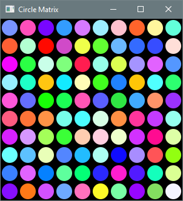

---

**b. Stained Glass.** Write a JavaFX application that fills the viewing area with tiny, 
overlapping, squares. Each square's color and angle of rotation are selected at random.

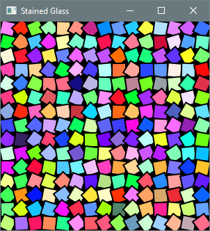

---

**c. Disjoint Circles.** Write a JavaFX application that draws a set of disjoint circles. The 
location, radius, and fill color of each circle are selected at random. Use the root node as a container for all of the circles.

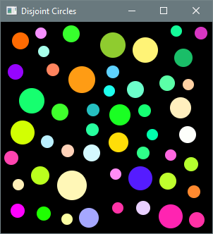

Before adding a new circle to the root node, you must ensure that it does not intersect an existing 
one. The following code can be used for this purpose.

```java
boolean intersectionFound = false; 
for (Node node: root.getChildren()) { 
    Circle circle = (Circle) node; 
    Bounds bounds = circle.getBoundsInParent(); 
    if (circleToAdd.intersects(bounds)) { 
        intersectionFound = true;
    } 
}
```

---

**d. Chaos on a Square.** Section 6.2.3 described the construction of a fractal called a Sierpinski 
triangle. We can apply the same general idea using the corners of a square instead of a triangle and 
repeatedly moving the current point halfway to a randomly chosen corner. However, in this version we 
must ensure that the same corner is not chosen twice in a row. Modify Listing 6.2.3a to draw this 
fractal. The construction of the Sierpinski triangle and the modification described here are both 
instances of a general concept known as the 
<a href="https://en.wikipedia.org/wiki/Chaos_game">Chaos Game</a>.

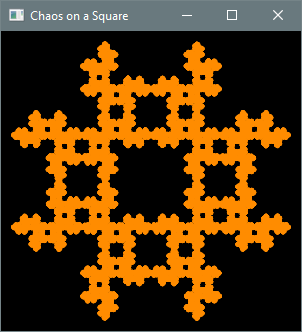
